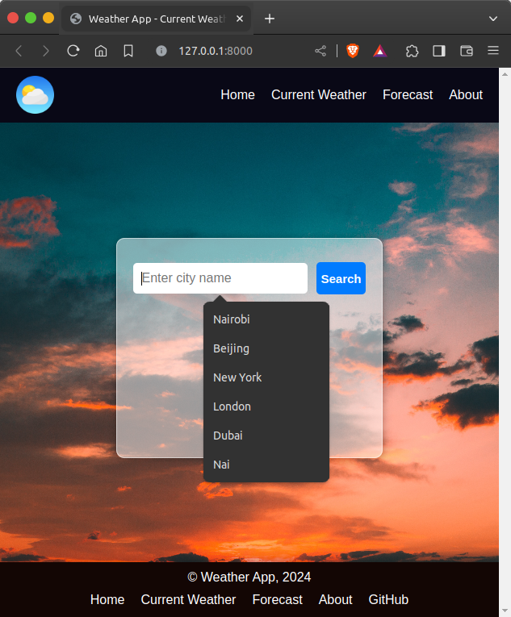
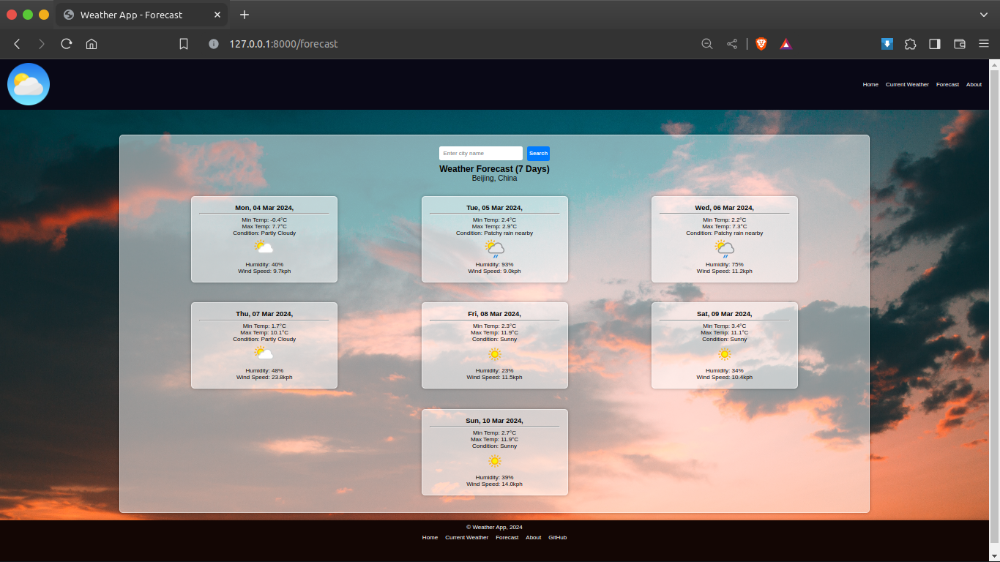
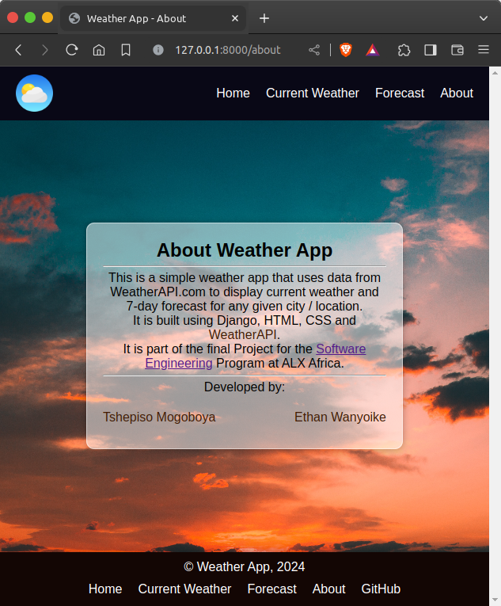

# **ALX Weather API**

This is the primary repository for the ALX  Weather API, a free and open API designed to serve weather forecast data using the same syntax as Dark Sky.

## **Contributors**

1. Ethan Wanyoike <ethanmuthoni@gmail.com>
2. Tshepiso Mogoboya <kgiveso@gmail.com>

## **Why**

Weather forecasts are produced by government agencies using computational models; however, the data is hard to work with. Instead, there are a bunch of companies that take this data, process it, and provide easier to work with APIs. However, the steps that the data goes through aren't public or documented (for example, what do they mean by "percent of precipitation"?!?). We put this service together in order to provide a better way for people to know where their weather data is coming from and how it is being processed!

## **Technologies Used**

This project was completed using:

* HTML/CSS
* Python (Django)
* Redis Database
* WeatherAPI (<https://api.weatherapi.com>)

## How to Run this project

To run this project on your local Unix machine, ensure that Redis database is installed.

To install redis, run `sudo apt install redis`

Also, ensure that the following Python packages/frameworks are installed:

* Django,
* json,
* redis
* requests

The packages can be installed using `pip install requests json redis django`

At this point, you can clone this project's repository using any of the following methods:

1. Using `git` command: `git clone https://github.com/reckafella/alx-final_project`
2. Using `github cli` tool: `gh clone reckafella/alx-final_project`

Navigate to the project's root directory and run: `python3 manage.py runserver`

The project is now live. Enjoy.

## **Project Gallery**

This section contains a selection of screenshots illustrating how the User Interface looks like.

1. Home Page

2. Current Weather results

![[Current Weather]](./pictures/current-weather.png)

3. Forecast Weather Results

4. About Page

